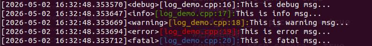

# GoodLog


English | [简体中文](README.zh-CN.md)

A lightweight C++17 logging wrapper around Boost.Log with colored console output, automatic source location, rotating log files, severity filtering, and binary hex dump helpers.

GoodLog is designed for C++ services, robotics tools, middleware modules, and debugging-heavy applications that need practical logging without rewriting the same Boost.Log setup in every project.

## Preview



## Why GoodLog?

Boost.Log is powerful, but the setup can become verbose when a project only needs a clean daily workflow: initialize logging once, print readable messages, keep rotated files, and filter noisy output by severity or channel.

GoodLog keeps Boost.Log as the backend and provides a smaller macro-based interface for everyday development.

## Features

- C++17 logging wrapper built on Boost.Log
- `trace`, `debug`, `info`, `warning`, `error`, and `fatal` severity levels
- Automatic `file:line` source location in each log call
- Colored console prefixes for important severities
- Rotating file sink with max file size and max file count control
- Console and file severity thresholds can be configured separately
- Optional channel filtering during initialization
- Hex dump helpers for binary buffers and protocol debugging
- CMake build with demo and GoogleTest targets
- Installable CMake package with `find_package(GoodLog)` support

## Requirements

GoodLog is currently best supported on Linux and WSL. The current CMake files link Linux system libraries such as `pthread`, `dl`, and `rt`, so native Windows and macOS builds may need small CMake adjustments.

Required for the library and demo:

- C++17 compiler, such as `g++` or `clang++`
- CMake 3.5+
- Boost development libraries, including `Boost.Log`, `Boost.LogSetup`, `Boost.Filesystem`, `Boost.Thread`, and `Boost.System`

Required only when building tests:

- GoogleTest development package

If you only want to build and run the demo, you can disable tests with `-DBUILD_TEST=OFF`.

## Install Dependencies

### Ubuntu / Debian / WSL

```bash
sudo apt update
sudo apt install -y build-essential cmake libboost-all-dev libgtest-dev
```

Then build with tests enabled:

```bash
git clone https://github.com/SoleyRan/Log.git
cd Log
cmake -S . -B build -DBUILD_DEMO=ON -DBUILD_TEST=ON
cmake --build build
ctest --test-dir build
./build/demo/log_demo
```

If you do not want to install GoogleTest, build only the library and demo:

```bash
git clone https://github.com/SoleyRan/Log.git
cd Log
cmake -S . -B build -DBUILD_DEMO=ON -DBUILD_TEST=OFF
cmake --build build
./build/demo/log_demo
```

### Fedora

```bash
sudo dnf install -y gcc-c++ cmake boost-devel gtest-devel
```

Then use the same CMake commands shown above.

### macOS

macOS is not the primary tested target yet. You can install the basic dependencies with Homebrew:

```bash
brew install cmake boost googletest
```

The current CMake files contain Linux-specific linker flags, so macOS may require CMake cleanup before it builds cleanly.

### Windows

For Windows users, WSL Ubuntu is the recommended path today:

```powershell
wsl --install
```

After entering Ubuntu in WSL, follow the Ubuntu / Debian setup above.

Native Windows support is not fully documented yet because the current CMake files use Linux-specific libraries.

## Quick Start

For a minimal Linux/WSL build without tests:

```bash
git clone https://github.com/SoleyRan/Log.git
cd Log
cmake -S . -B build -DBUILD_TEST=OFF
cmake --build build
./build/demo/log_demo
```

By default, the demo writes rotated log files under `/tmp/goodlog/`.

## Install As A CMake Package

GoodLog can be installed into a prefix and consumed by another CMake project with `find_package(GoodLog)`.

Install to a local user prefix:

```bash
git clone https://github.com/SoleyRan/Log.git
cd Log
cmake -S . -B build -DCMAKE_BUILD_TYPE=Release -DBUILD_DEMO=OFF -DBUILD_TEST=OFF
cmake --build build
cmake --install build --prefix "$HOME/.local"
```

Install to a system prefix:

```bash
git clone https://github.com/SoleyRan/Log.git
cd Log
cmake -S . -B build -DCMAKE_BUILD_TYPE=Release -DBUILD_DEMO=OFF -DBUILD_TEST=OFF
cmake --build build
sudo cmake --install build --prefix /usr/local
```

The install layout looks like this:

```text
<prefix>/
|-- include/goodlog/
|   |-- log.hpp
|   `-- text_file_backend_self_defined.hpp
|-- lib/
|   `-- libgood_log.so
`-- lib/cmake/GoodLog/
    |-- GoodLogConfig.cmake
    |-- GoodLogConfigVersion.cmake
    |-- GoodLogTargets.cmake
    `-- GoodLogTargets-*.cmake
```

Use it from another CMake project:

```cmake
cmake_minimum_required(VERSION 3.5)
project(MyApp LANGUAGES CXX)

find_package(GoodLog REQUIRED)

add_executable(my_app main.cpp)
target_link_libraries(my_app PRIVATE GoodLog::good_log)
```

Then include GoodLog in your source file:

```cpp
#include <log.hpp>

int main()
{
    goodlog::logInit("/tmp/my_app_logs/", 2, 1, 10, 10);
    LOG_Info() << "hello from installed GoodLog";
    return 0;
}
```

If GoodLog is installed to a custom prefix, point CMake to that prefix when configuring your application:

```bash
cmake -S . -B build -DCMAKE_PREFIX_PATH="$HOME/.local"
cmake --build build
```

## Create A Release Package

You can stage an install tree and archive it for a GitHub release:

```bash
cmake -S . -B build -DCMAKE_BUILD_TYPE=Release -DBUILD_DEMO=OFF -DBUILD_TEST=OFF
cmake --build build
cmake --install build --prefix package/goodlog-0.1.0
tar -C package -czf goodlog-0.1.0-linux-x86_64.tar.gz goodlog-0.1.0
```

Users can unpack the archive and pass its path through `CMAKE_PREFIX_PATH`.

## Basic Usage

```cpp
#include <log.hpp>

int main()
{
    const std::string log_path = "/tmp/goodlog/";
    const int console_log_level = 2; // info and above
    const int file_log_level = 1;    // debug and above
    const int max_log_size_mb = 10;
    const int max_log_files = 10;

    goodlog::logInit(
        log_path,
        console_log_level,
        file_log_level,
        max_log_size_mb,
        max_log_files
    );

    LOG_Debug() << "debug details";
    LOG_Info()  << "service started";
    LOG_Warn()  << "using fallback config";
    LOG_Error() << "connection failed";
    LOG_Fatal() << "unrecoverable error";

    return 0;
}
```

## Output Shape

GoodLog formats records with timestamp, severity, source location, and your message:

```text
[2026-05-02 10:24:18.123456]<info>[main.cpp:18]:service started
[2026-05-02 10:24:18.123789]<warning>[main.cpp:19]:using fallback config
[2026-05-02 10:24:18.124000]<error>[main.cpp:20]:connection failed
```

Log files are written with a sortable counter and timestamp pattern:

```text
00000-2026-05-02-10-24-18.log
00001-2026-05-02-10-27-42.log
```

## Severity Levels

The `console_log_level` and `file_log_level` arguments map to Boost.Log trivial severities:

| Value | Severity |
| --- | --- |
| `0` | trace |
| `1` | debug |
| `2` | info |
| `3` | warning |
| `4` | error |
| `5` | fatal |

This makes it easy to keep terminal output quiet while preserving more detail in log files.

## Hex Dump Helpers

GoodLog includes helpers for binary data inspection, useful when debugging packets, sensors, middleware frames, or custom protocols.

```cpp
std::array<unsigned char, 4> payload = {0x12, 0x34, 0xab, 0xcd};

LOG_DEBUG_HEX(payload.data(), payload.size(), "rx payload");
```

## Build Options

The root CMake project exposes demo and test switches:

```bash
cmake -S . -B build -DBUILD_DEMO=ON -DBUILD_TEST=ON
cmake --build build
ctest --test-dir build
```

Options:

| Option | Default | Description |
| --- | --- | --- |
| `BUILD_DEMO` | `ON` | Builds `demo/log_demo.cpp` |
| `BUILD_TEST` | `ON` | Builds GoogleTest tests under `test/` |

Useful build variants:

```bash
# Build library and demo only
cmake -S . -B build -DBUILD_DEMO=ON -DBUILD_TEST=OFF

# Build library only
cmake -S . -B build -DBUILD_DEMO=OFF -DBUILD_TEST=OFF

# Build with tests
cmake -S . -B build -DBUILD_DEMO=ON -DBUILD_TEST=ON
```

## Troubleshooting

If CMake cannot find Boost, make sure the Boost development package is installed:

```bash
sudo apt install -y libboost-all-dev
```

If CMake cannot find GTest, either install it or disable tests:

```bash
sudo apt install -y libgtest-dev
cmake -S . -B build -DBUILD_TEST=ON
```

or:

```bash
cmake -S . -B build -DBUILD_TEST=OFF
```

If your application cannot find an installed GoodLog package, pass the install prefix through `CMAKE_PREFIX_PATH`:

```bash
cmake -S . -B build -DCMAKE_PREFIX_PATH="$HOME/.local"
```

If the demo runs but no log files are obvious, check the default output directory:

```bash
ls -la /tmp/goodlog/
```

## Project Layout

```text
.
|-- CMakeLists.txt
|-- cmake/
|   `-- GoodLogConfig.cmake.in
|-- demo/
|   `-- log_demo.cpp
|-- src/
|   |-- log.hpp
|   |-- text_file_backend_self_defined.cpp
|   `-- text_file_backend_self_defined.hpp
`-- test/
    `-- log_test.cpp
```

## When To Use It

GoodLog is a good fit when you want a small C++ logging layer for an application, tool, or middleware module and you already use Boost in your stack.

For a large public framework, a cross-platform package manager release, or a dependency-free logger, this project may need more hardening first.

## Roadmap

- Add CI builds for Ubuntu
- Add package examples for application integration
- Clean up channel macro namespace consistency
- Improve native Windows and macOS CMake support
